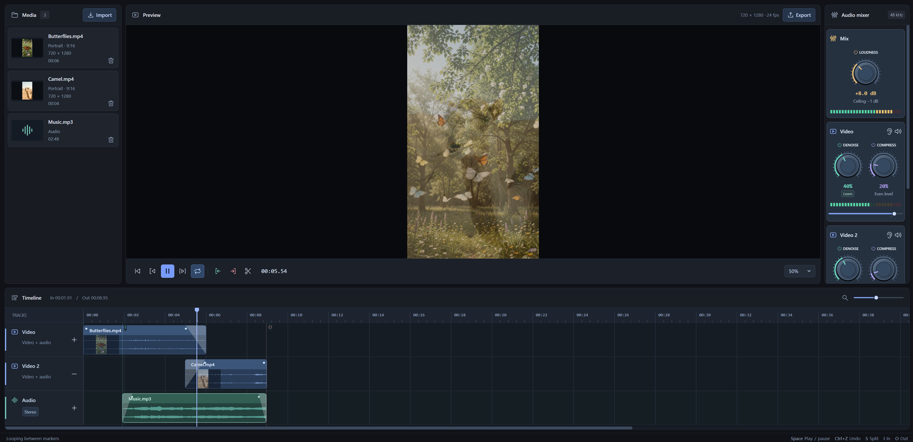

# Bill's Video Editor

This is a simple video editor that runs in the browser. If you just want to trim some clips, glue them together, fix the audio, and export something to upload to YouTube without installing anything or logging in, this might be all you need. If not, feel free to fork it and have your agent personalize it with the features you want.

**Use in your browser:**  
<https://william-kerr.github.io/video-editor>

## Screenshot

## Running Locally

See [DEVELOPMENT.md](DEVELOPMENT.md) for local setup.

## Background

I was inspired by someone who canceled their Photoshop subscription and built their own app with the features they needed using AI. I periodically subscribe to use Adobe products and thought I'd see if a vibe coded video editor was any good.

### Disclaimer

Although I **despise** vibe slop when it comes to something I'm passionate about, I don't mind vibing personal tools into existence that I don't want to pay for. So, this is just a tool, not a masterpiece.
